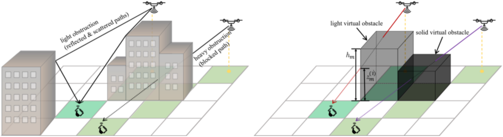
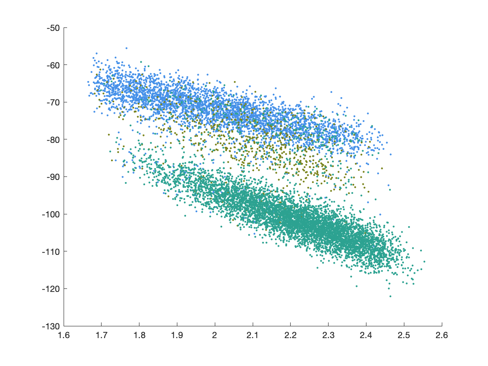
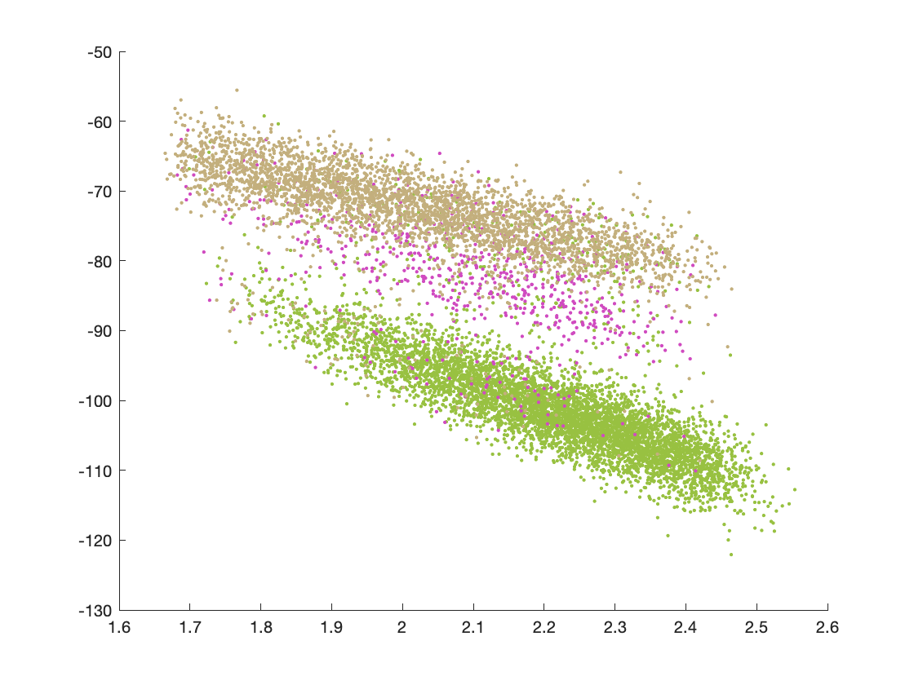
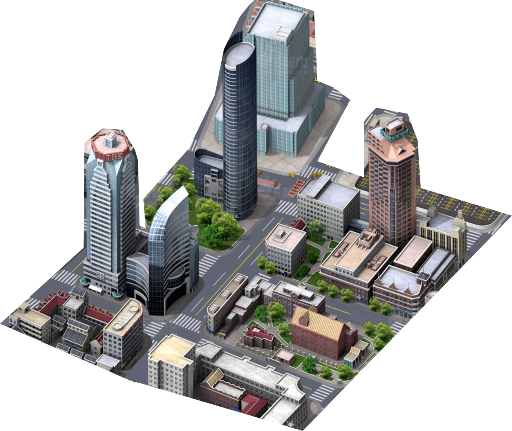
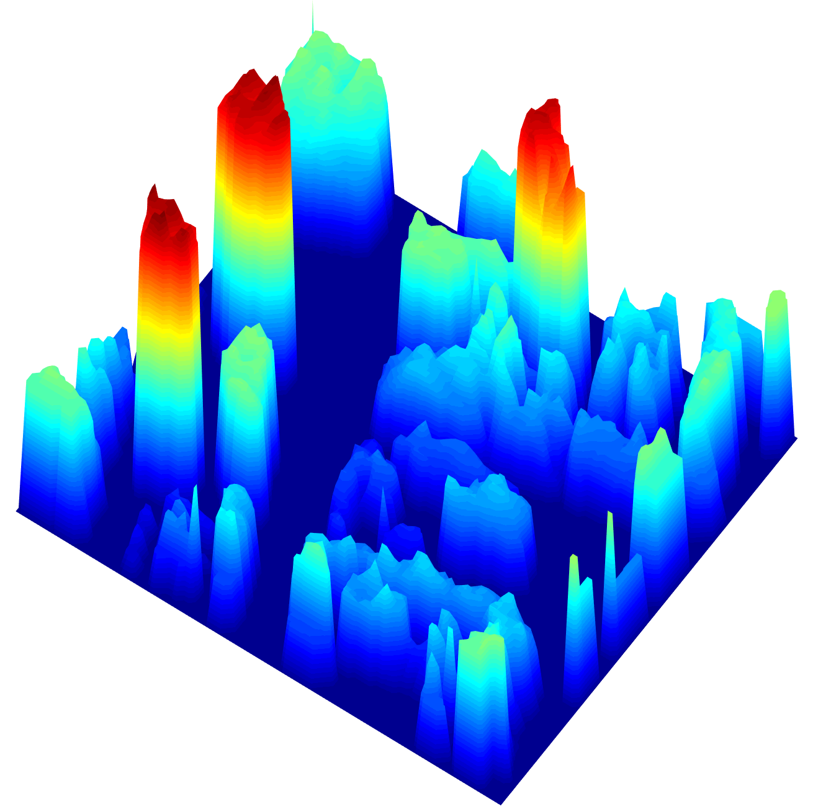

# Radio Map Learning and Reconstruction Exploiting Environment Semantics

MATLAB code of the algorithms developed in a paper titled "Radio Map Learning and Reconstruction Exploiting Environment Semantics". Its capabilities include but are not limited to radio map reconstruction, reconstructing the geometry semantics of the radio environment (virtual obstacle reconstruction for urban cities), and radio map based localization.

This repository contains:

1. [Experiments of Dataset A](main_a.m) for a demo showing very fast radio map construction.
2. [Experiments of Dataset B](main_b.m) for a demo showing the aforementioned three main features. Accurate but slow.
3. [Extra experiments](main_c.m) for a demo extending to K>1. Figures plotted by it are not shown in the paper.
4. [Dataset visualization](dataset_visualization.m) plots some examples of the radio map ground truth.
5. City maps and code for generating simulation data.

There are also many useful functions in the [Sub](Sub) directory.

## Table of Contents

- [Radio Map Learning and Reconstruction Exploiting Environment Semantics]
	- [Table of Contents](#table-of-contents)
	- [Background](#background)
	- [Install](#install)
	- [Usage](#usage)
		- [Generator](#generator)
	- [Result Screenshots](#result-screenshots)
	- [Related Efforts](#related-efforts)
	- [Maintainers](#maintainers)
	- [Contributing](#contributing)
	- [License](#license)

## Background

Radio maps can be used for link performance prediction, wireless relay planning, and source localization. This paper constructs an air-to-ground radio map to predict the channel gain for each link that connects a ground terminal with a low altitude unmanned aerial vehicle (UAV). The challenge is the insufficiency of measurement samples for a radio map in full dimension, where each data point is 6-dimensional as the transmitter and the receiver each has three spatial degrees of freedom. In addition, it is also expensive to convey or share large-size radio maps to mobile
decision makers in the network. Classical methods, such as k-nearest neighbor (KNN) and Kriging, may fail for insufficient data. This paper proposes to exploit the propagation property in the geometry semantics of the environment to assist the radio map construction. Specifically, the radio map is built via reconstructing a virtual geometry environment.

- A multi-class virtual obstacle model embedded in a environment-aware multi-degree channel model is developed. 
- A least-squares problem is formulated to learn the virtual obstacle map and the model parameters. 

The paper investigates the **partial quasiconvexity** of the least-squares problem, and based on that, an efficient radio map learning algorithm is developed. In addition, a data-driven approach is employed to build a residual shadowing map to further improve the details of the constructed radio map. Our numerical results confirm that the proposed method significantly increases the prediction accuracy compared to a Kriging baseline, and reduces the required measurements by more than a half. When the constructed radio map is applied to received signal strength (RSS) based localization in a dense urban environment, substantial performance improvement is observed where a sub-20-meter accuracy is achieved.

## Install

This project is tested on MATLAB R2018a and MATLAB R2020b.

## Usage

Download all project files and run [main_a.m](main_a.m), [main_b.m](main_b.m) and [main_c.m](main_c.m).

### Generator

To use the simulation data generator, you can appoint a city map as urban topology data and channel model parameters.

## Result Screenshots

[1] Measurement classification (for K=2)  

| | |
| ------------- |:-------------:| 
||  |

[2] Virtual obstacle reconstruction  

| | |
| ------------- |:-------------:| 
||  |

## Related Efforts

- [RadioUNet](https://github.com/RonLevie/RadioUNet) - Convolutional neural network for estimating radio maps in urban environments.
- [WSN-Localization](https://github.com/kritiksoman/WSN-Localization) - MATLAB script for node localization in Wireless Sensor Network.

## Maintainers

[@6wj](https://github.com/6wj).

## Contributing

Feel free to dive in! [Open an issue](https://github.com/6wj/radiomap-uav/issues/new) or submit PRs.

## License

[MIT](LICENSE) © WISE lab
